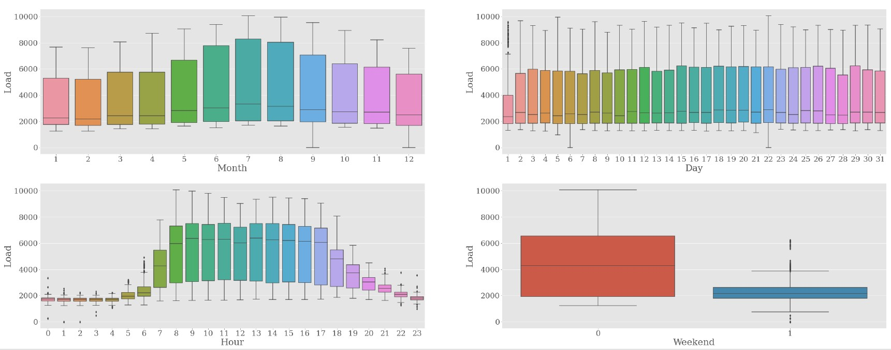
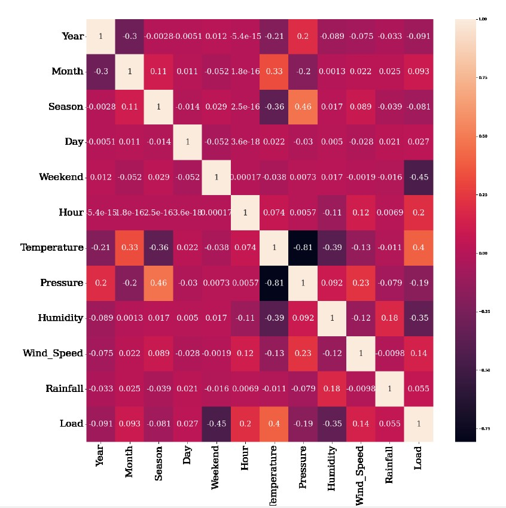

# Spatial-Temporal-Attention-Model
📍 I proposes a novel spatio-temporal attention model to learn the spatial and temporal dependence from the time-series data.

📍 Building load forecasting is a multivariate time-series forecasting problem. An accurate forecasting model should capture the complicated dependency between the variables at each time point and the long-range temporal relationship between the data points

#  📚 spatial relationships
📍 The temporal correlation represents the correlation between different time steps and the spatial correlation represents the correlation between different variables.

📍 We performed a data exploration using the heatmap to present spatial relationships on commercial building electricity load dataset.

📍 Thus, allowing the proposed model to learn information in both time and spatial domains jointly is important.

# :open_file_folder: Dataset
📗 I am using a real usecase dataset from power company to electricity load forecasting. The number of data samples in the dataset is 20424, and the time resolution is one hour.

📗 Given a sequence of data samples indexed in time, x1, . . . , xt, . . ., each data sample xt ∈ RD represents the data at time t and comprises D features. Training data are denoted as D ={(x1, y1), (x2, y2), . . . (xN, yN)}, where x1 = x1, . . . , xT and y1 = yT+1, . . . , yT+1+m denote the first sequence and the corresponding label, x2 = x2, . . . , xT+1 and y2 = yT+2, . . . , yT+2+m are the second sequence and the corresponding label, and so on. This work uses time series data of length T to predict future results of the horizon size m. In the experiments, we use different values of T and m to carry out the experiments.

#  📚 Feature Engineering
##  Seasonal Extraction
📍 If seasonality and trend can be extracted or identified from time-series data, these extracted components can help the predictive model improve the forecasting performance

📍 I propose using the convolution filter and moving average to extract the seasonality from time-series data for adding feature in model.

📍 that seasonality information can be extracted from the five features used in the experimental dataset

## Data Embedding
📍 The main advantage of the embedding layer is that it can embed much more information into an embedding vector

📍 I use three embedding techniques to capture representative information of the data, time embedding, token embedding, and position embedding

### time embedding
  
📍 The time features are cyclical, such as year, month, day, hour, and holiday features; furthermore, the electricity consumption changes regularly with time features. Holidays have a great impact on electricity load.

📍 we use the embedding technique for the time feature and then project the input into a space of d-dimension by a feed-forward layer.

### Token embedding
  
📍 We have D features at each time step t. To extract the local information of the data, we use the 1D convolution layer to obtain the d-dimensional embedding vectors (d > D) in time steps

### Position embedding:
  
📍 To obtain information on the order of the input, we add the positional embedding to the input embedding of the sequence.

📍 The embedding is performed by sinusoidal waves, which show closeness in the vector representation with respect to small changes in positions.

#  📚 Model structure
Framework first uses the seasonal extraction approach to extract the seasonality of data, then uses the time embedding technique to learn the data representation.
Subsequently, the data is the input of the encoder-decoder model, which comprises an encoder and a decoder.

## Encoder
encoder comprises a stack of two identical blocks, each of which comprises several components: the multi-head ProbSparse attention layer, dropout layer, add & norm layer, positionwise feed-forward network (FFN) layer, long short-term memory (LSTM) layer, add & norm layer, spatial & temporal convolution layer, and maxpooling layer in order.

## Decoder
the decoder comprises masked multi-head ProbSparse attention layer, dropout layer, add & norm layer, multi-head attention layer, dropout layer, add & norm layer, positionwise FFN layer, add & norm layer and fully connected layer in order. In addition, we add dropout to the embedding layer, position-wise feed-forward network layer and attention outputs in encoder and decoder.

## Multi-head mechanism
Given an input sequence, self-attention [[1]](https://papers.nips.cc/paper_files/paper/2017/hash/3f5ee243547dee91fbd053c1c4a845aa-Abstract.html) is a mechanism that can produce a new sequence of the same length, and each output element is based on the aggregation
of inputs of different positions by calculating the similarity and determining the attention weights on these inputs.

📍 the multi-head mechanism is used in the calculation of the ProbSparse attention. The Q, K, and V can map the input vector to different sub-spaces through different linear layers.

📍 In this case, attention produces different sparse query-key pairs for each head. Hence, the integrated effect of several attentions at the same time may be better than
that of a single attention.

## Multi-head ProbSparse Self-attention with Long Short-Term Memory Block
📍 Zhou et al. [[2]](https://ojs.aaai.org/index.php/AAAI/article/view/17325) found that the probability distribution of self-attention has a potential sparsity, that is, only a few inner products contribute to the main attention. 

📍 Therefore, they proposed ProbSparse attention Zhou et al. [[2]](https://ojs.aaai.org/index.php/AAAI/article/view/17325) to address this problem by computing a limited selection of similarity scores from a sequence rather than all possible pairs.

📍 the use of memory and space in the self-attention mechanism would decrease.

## Spatial and Temporal Convolution Block
* multivariate time series data can be characterized by high spatial-temporal dependency attributes. The data used in this thesis include the forecast sequence T, and many variables are involved in each time step.

* To capture the spatial dependence and the temporal dependence, we use two 1D convolutions with a proper stride and padding in parallel to summarize the sequence information.
  * Spatial convolution: The filters of size 1×k are used to capture the spatial information pattern of all time steps, where k is the kernel size. Once the convolution process is completed, a vector of size 1×T is produced using the kernel to advance over time steps. Given nq filters, the output matrix Hq is of size nq × T by concatenating all the filters along the first dimension
  * Temporal convolution: use a 1D convolution in parallel to model local temporal patterns. The input matrix of the previous layer is transposed for the temporal dependencies, and the filters are of the size 1 × k filters.

#  📚 Model Training
## Combination of Optimizer
📍 use SGD and ADAM to optimize the parameters of the attention layer and the other layers, respectively.

📍 In the attention layer, our aim is to update the parameters in a stable manner, which can boost the prediction performance and have a better generalization of the testing data. Furthermore, ADAM is used to optimize the other layers, such as the convolution layer, to increase the training speed and convergence during the training phase.

## Experimental Settings
To demonstrate that our model can be applied to long-term prediction, we use different input window sizes T and forecasting horizon values m to conduct forecasting experiments, in which T ∈ {72, 168, 240, 360} and m ∈ {72, 168, 240, 360}. The previous time period of size T is used to predict the next time period of sizem and the time step is 1 hour.

#  📚 Experimental Results
* In the experiments, we use state-of-the-art or several classical methods as comparison methods, including methods based on the attention mechanism and the classical deep learning methods used in time series forecasting.
  * Informer [[2]](https://ojs.aaai.org/index.php/AAAI/article/view/17325)
  * Transformer [[1]](https://papers.nips.cc/paper_files/paper/2017/hash/3f5ee243547dee91fbd053c1c4a845aa-Abstract.html)
  * A2-Nets [[3]](https://dl.acm.org/doi/abs/10.5555/3326943.3326976)
  * MLP-Mixer [[4]](https://proceedings.neurips.cc/paper/2021/hash/cba0a4ee5ccd02fda0fe3f9a3e7b89fe-Abstract.html)
  * ECA-Net [[5]](https://arxiv.org/abs/1910.03151)

* The experimental results show that the proposed model outperforms other comparison models. Despite the proposed method being based on the informer, the proposed method comprises spatial and temporal convolution modules for time series; both can capture spatial and temporal correlations between time steps and features.

* Time series decomposition
  * Level
  * Trend
  * Seasonality 
  * Noise
  
* Stationarity
  * AC and PAC plots
  * Rolling mean and std
  * Dickey-Fuller test
  
* Making our time series stationary
  * Difference transform
  * Log scale
  * Smoothing
  * Moving average

# :triangular_ruler: Models tested

* Autoregression ([AR](https://www.statsmodels.org/stable/generated/statsmodels.tsa.ar_model.AR.html))
* Moving Average (MA)
* Autoregressive Moving Average (ARMA)
* Autoregressive integraded moving average (ARIMA)
* Seasonal autoregressive integrated moving average (SARIMA)
* Bayesian regression [Link](https://scikit-learn.org/stable/auto_examples/linear_model/plot_bayesian_ridge.html)
* Lasso [Link](https://scikit-learn.org/stable/modules/generated/sklearn.linear_model.Lasso.html)
* SVM [Link](https://scikit-learn.org/stable/modules/classes.html?highlight=svm#module-sklearn.svm)
* Randomforest [Link](https://scikit-learn.org/stable/modules/generated/sklearn.ensemble.RandomForestRegressor.html?highlight=randomforest#sklearn.ensemble.RandomForestRegressor)
* Nearest neighbors [Link](https://scikit-learn.org/stable/modules/neighbors.html)
* XGBoost [Link](https://xgboost.readthedocs.io/en/latest/)
* Lightgbm [Link](https://github.com/microsoft/LightGBM)
* Prophet [Link](https://facebook.github.io/prophet/docs/quick_start.html)
* Long short-term memory with tensorflow (LSTM)[Link](https://www.tensorflow.org/)

* DeepAR

# :mag: Forecasting results
We will devide our results wether the extra features columns such as temperature or preassure were used by the model as this is a huge step in metrics and represents two different scenarios. Metrics used were:

## Evaluation Metrics
* Mean Absolute Error (MAE) 
* Mean Absolute Percentage Error (MAPE)
* Root Mean Squared Error (RMSE)
* Coefficient of determination (R2)

<table class="table table-bordered table-hover table-condensed">
<thead><tr><th title="Field #1">Model</th>
<th title="Field #2">mae</th>
<th title="Field #3">rmse</th>
<th title="Field #4">mape</th>
<th title="Field #5">r2</th>
</tr></thead>
<tbody><tr>
<td>EnsembleXG+TF</td>
<td align="right">27.64</td>
<td align="right">40.23</td>
<td align="right">0.42</td>
<td align="right">0.76</td>
</tr>
<tr>
<td>EnsembleLIGHT+TF</td>
<td align="right">27.34</td>
<td align="right">39.27</td>
<td align="right">0.42</td>
<td align="right">0.77</td>
</tr>
<tr>
<td>EnsembleXG+LIGHT+TF</td>
<td align="right">27.63</td>
<td align="right">39.69</td>
<td align="right">0.44</td>
<td align="right">0.76</td>
</tr>
<tr>
<td>EnsembleXG+LIGHT</td>
<td align="right">29.95</td>
<td align="right">42.7</td>
<td align="right">0.52</td>
<td align="right">0.73</td>
</tr>
<tr>
<td>Randomforest tunned</td>
<td align="right">40.79</td>
<td align="right">53.2</td>
<td align="right">0.9</td>
<td align="right">0.57</td>
</tr>
<tr>
<td>SVM RBF GRID SEARCH</td>
<td align="right">38.57</td>
<td align="right">50.34</td>
<td align="right">0.78</td>
<td align="right">0.62</td>
</tr>
<tr>
<td>DeepAR</td>
<td align="right">71.37</td>
<td align="right">103.97</td>
<td align="right">0.96</td>
<td align="right">-0.63</td>
</tr>
<tr>
<td>Tensorflow simple LSTM</td>
<td align="right">30.13</td>
<td align="right">43.08</td>
<td align="right">0.42</td>
<td align="right">0.72</td>
</tr>
<tr>
<td>Prophet multivariate</td>
<td align="right">38.25</td>
<td align="right">50.45</td>
<td align="right">0.74</td>
<td align="right">0.62</td>
</tr>
<tr>
<td>Kneighbors</td>
<td align="right">57.05</td>
<td align="right">80.39</td>
<td align="right">1.08</td>
<td align="right">0.03</td>
</tr>
<tr>
<td>SVM RBF</td>
<td align="right">40.81</td>
<td align="right">56.03</td>
<td align="right">0.79</td>
<td align="right">0.53</td>
</tr>
<tr>
<td>Lightgbm</td>
<td align="right">30.21</td>
<td align="right">42.76</td>
<td align="right">0.52</td>
<td align="right">0.72</td>
</tr>
<tr>
<td>XGBoost</td>
<td align="right">32.13</td>
<td align="right">45.59</td>
<td align="right">0.56</td>
<td align="right">0.69</td>
</tr>
<tr>
<td>Randomforest</td>
<td align="right">45.84</td>
<td align="right">59.45</td>
<td align="right">1.03</td>
<td align="right">0.47</td>
</tr>
<tr>
<td>Lasso</td>
<td align="right">39.24</td>
<td align="right">54.58</td>
<td align="right">0.71</td>
<td align="right">0.55</td>
</tr>
<tr>
<td>BayesianRidge</td>
<td align="right">39.24</td>
<td align="right">54.63</td>
<td align="right">0.71</td>
<td align="right">0.55</td>
</tr>
<tr>
<td>Prophet univariate</td>
<td align="right">61.33</td>
<td align="right">83.64</td>
<td align="right">1.26</td>
<td align="right">-0.05</td>
</tr>
<tr>
<td>AutoSARIMAX (1, 0, 1),(0, 0, 0, 6)</td>
<td align="right">51.29</td>
<td align="right">71.49</td>
<td align="right">0.91</td>
<td align="right">0.23</td>
</tr>
<tr>
<td>SARIMAX</td>
<td align="right">51.25</td>
<td align="right">71.33</td>
<td align="right">0.91</td>
<td align="right">0.23</td>
</tr>
<tr>
<td>AutoARIMA (0, 0, 3)</td>
<td align="right">47.01</td>
<td align="right">64.71</td>
<td align="right">1.0</td>
<td align="right">0.37</td>
</tr>
<tr>
<td>ARIMA</td>
<td align="right">48.25</td>
<td align="right">66.39</td>
<td align="right">1.06</td>
<td align="right">0.34</td>
</tr>
<tr>
<td>ARMA</td>
<td align="right">47.1</td>
<td align="right">64.86</td>
<td align="right">1.01</td>
<td align="right">0.37</td>
</tr>
<tr>
<td>MA</td>
<td align="right">49.04</td>
<td align="right">66.2</td>
<td align="right">1.05</td>
<td align="right">0.34</td>
</tr>
<tr>
<td>AR</td>
<td align="right">47.24</td>
<td align="right">65.32</td>
<td align="right">1.02</td>
<td align="right">0.36</td>
</tr>
<tr>
<td>HWES</td>
<td align="right">52.96</td>
<td align="right">74.67</td>
<td align="right">1.11</td>
<td align="right">0.16</td>
</tr>
<tr>
<td>SES</td>
<td align="right">52.96</td>
<td align="right">74.67</td>
<td align="right">1.11</td>
<td align="right">0.16</td>
</tr>
<tr>
<td>Yesterdays value</td>
<td align="right">52.67</td>
<td align="right">74.52</td>
<td align="right">1.04</td>
<td align="right">0.16</td>
</tr>
<tr>
<td>Naive mean</td>
<td align="right">59.38</td>
<td align="right">81.44</td>
<td align="right">1.32</td>
<td align="right">-0.0</td>
</tr>
</tbody></table>

 

# :shipit: Additional resources and literature

## Models not tested but that are gaining popularity 
There are several models we have not tried in this tutorials as they come from the academic world and their implementation is not 100% reliable, but is worth mentioning them:

* Neural basis expansion analysis for interpretable time series forecasting (N-BEATS) | [link](https://arxiv.org/abs/1905.10437) [Code](https://github.com/philipperemy/n-beats)
* ESRRN [link](https://eng.uber.com/m4-forecasting-competition/)  [Code](https://github.com/damitkwr/ESRNN-GPU)

#
| | |
| - | - |
| Adhikari, R., & Agrawal, R. K. (2013). An introductory study on time series modeling and forecasting | [[1]](https://arxiv.org/ftp/arxiv/papers/1302/1302.6613.pdf)|
| Introduction to Time Series Forecasting With Python | [[2]](https://machinelearningmastery.com/introduction-to-time-series-forecasting-with-python/)|
| Deep Learning for Time Series Forecasting | [[3]](https://machinelearningmastery.com/deep-learning-for-time-series-forecasting/ )
| The Complete Guide to Time Series Analysis and Forecasting| [[4]](https://towardsdatascience.com/the-complete-guide-to-time-series-analysis-and-forecasting-70d476bfe775)| 
| How to Decompose Time Series Data into Trend and Seasonality| [[5]](https://machinelearningmastery.com/decompose-time-series-data-trend-seasonality/)

# Contributing
Want to see another model tested? Do you have anything to add or fix? I'll be happy to talk about it! Open an issue/PR :) 

